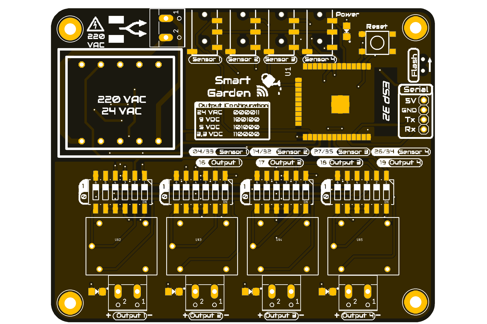
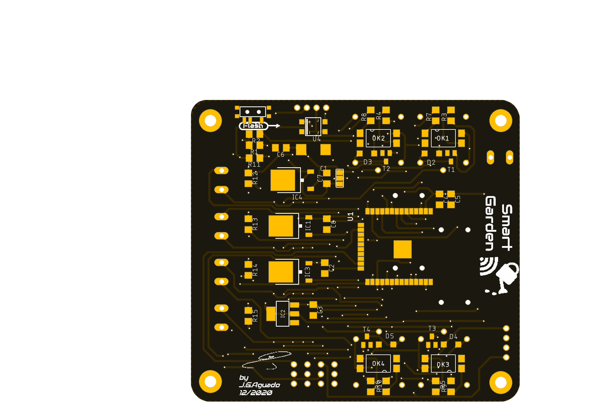

# Smart Garden
The Smart Garden project is the all-in-one solution for controlling the garden based on an ESP32. 

With the Smart Garden board you can read up to 4 different wired sensors or other Bluetooth based devices (such as the Xiaomi Mi Flora) and activate the water irrigators (electrovalves or water pumps) according to your own automations and routines!

### Specifications:
 * ESP32 based (Bluetooth and Wifi functionalities)
 * 220 VAC direct connection (no need for adaptors)
 * Inputs: 4 wired connections with 2 analog ports each 
 * Outputs: 4 relays with configurable output (24VAC, 9VDC, 5VCD or 3.3VDC)

### Applications:
Simple and efective solution for DIY Gardening installations based on the programable ESP32 chipset. Control any 24V AC electrovalve or smaller 5V DC water pumps just by configuring the switches onboard.

### Repository Contents
-------------------
* **/Documentation** - Data sheets, schematics, illustrations (.pdf)
* **/Hardware** - All Eagle design files (.brd, .sch)
* **/Production** - Production gerber files 
* **/Silkscreen** - Silkscreen documentation (.ppt, .png)

## License Information
-------------------
 Domotics by <a xmlns:cc="http://creativecommons.org/ns#" href="https://github.com/SpaceDIY/Domotics" property="cc:attributionName" rel="cc:attributionURL">J.G.Aguado</a> is licensed under a <a rel="license" href="http://creativecommons.org/licenses/by-nc/4.0/">Creative Commons ShareAlike 4.0 International License</a>.

Distributed as-is; no warranty is given.