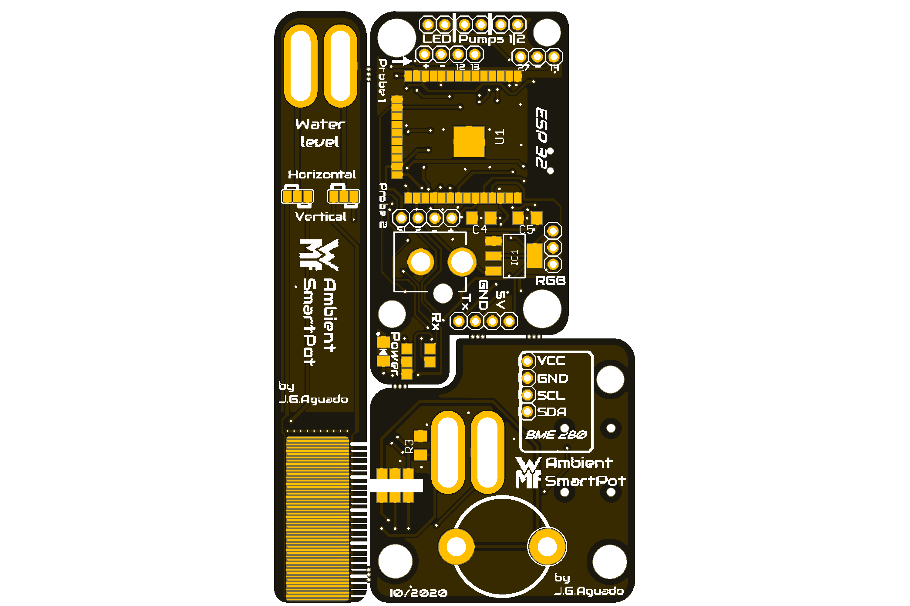
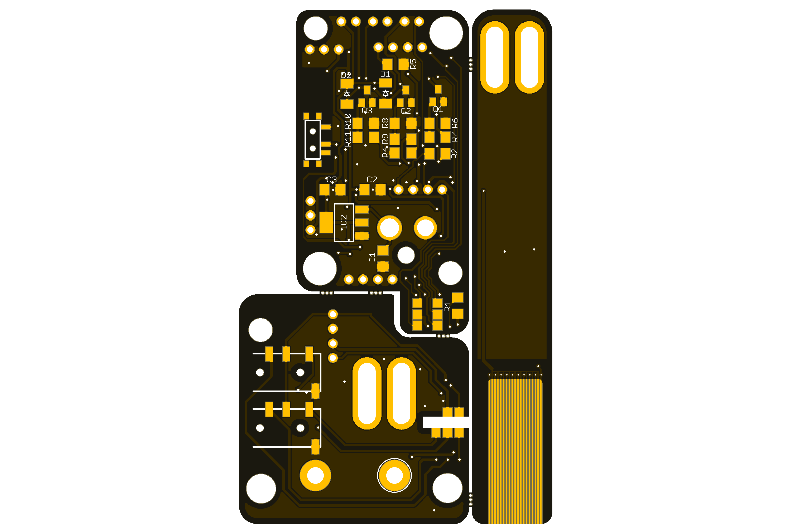

# WMF Ambient SmartPot
The WMF Ambient SmartPot project is a set of PCBs alternative to the original [WMF Ambient Pot](https://www.wmf.com/es/wmf-ambient-kraeuter-athome.html) that provides a full smart solution for monitoring the plants.

### Specifications:
 * ESP32 based (Bluetooth and Wifi functionalities)
 * Port for Neopixel LEDs
 * Support for 2 PWM driven pupms
 * Support for the original "touch" functionality
 * Support for the BME 280
 * Water level of the tank sensor
 * Wired probes support

### Applications:
Plug the Xiaomi Mi Flora on each pot and read the parameters provided via Bluetooth, or via the integrated ambient sensor BME 280. Push the parameters to a MQTT server or display the values throught the Neopixel LED array.

Set alerts when the temperatures drop or automatize watering tasks with the PWM support for 5V water pumps

### Repository Contents
-------------------
* **/Documentation** - Data sheets, schematics, illustrations (.pdf)
* **/Hardware** - All Eagle design files (.brd, .sch)
* **/Production** - Production gerber files 
* **/Silkscreen** - Silkscreen documentation (.ppt, .png)

## License Information
-------------------
 Domotics by <a xmlns:cc="http://creativecommons.org/ns#" href="https://github.com/SpaceDIY/Domotics" property="cc:attributionName" rel="cc:attributionURL">J.G.Aguado</a> is licensed under a <a rel="license" href="http://creativecommons.org/licenses/by-nc/4.0/">Creative Commons ShareAlike 4.0 International License</a>.

Distributed as-is; no warranty is given.